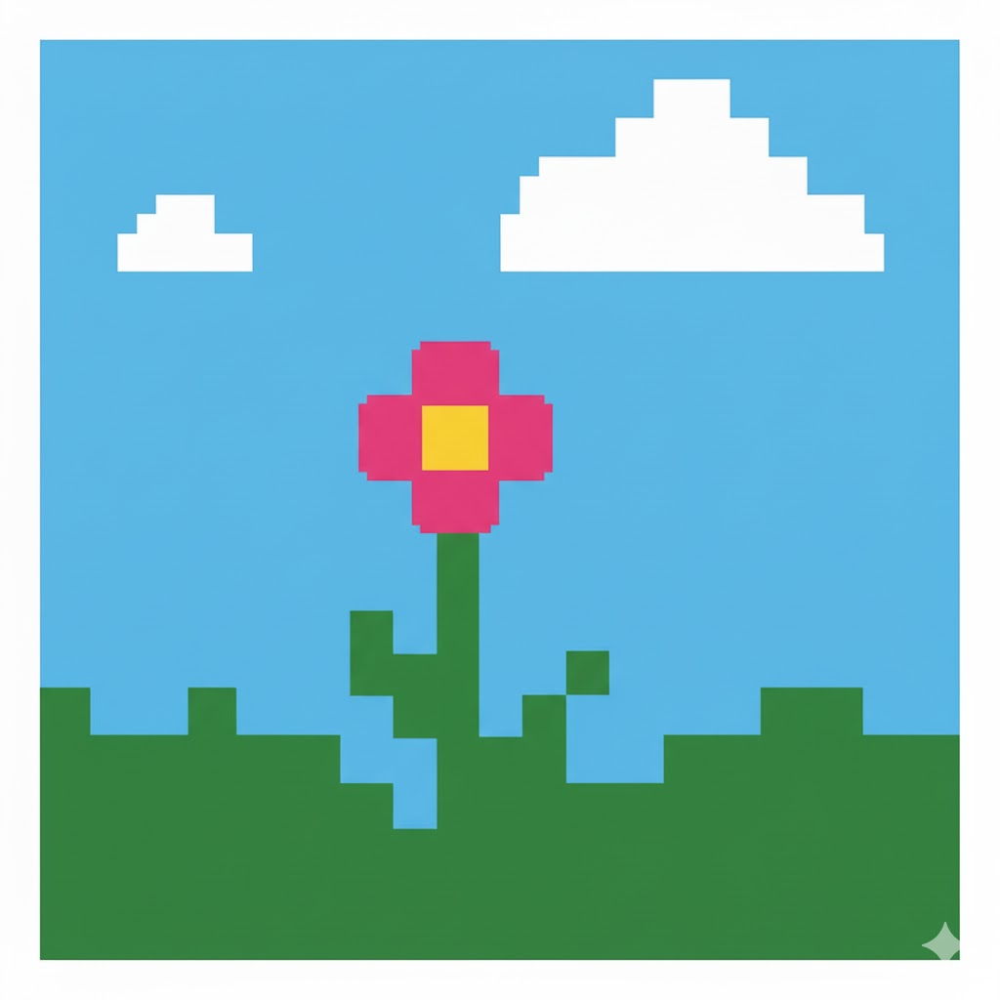
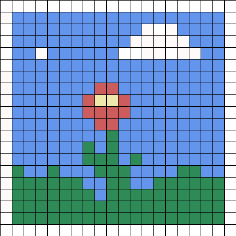
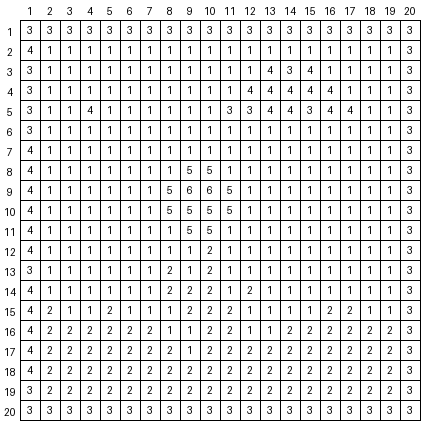

## Pixel Coding Page Generator

Turn any image into a printable coding page for kids. The tool converts an input image to:
- an empty grid with row and column labels ready to print,
- a legend that lists which squares should be coloured with each CSS3 colour name,
- a filled preview so you can verify the result before printing.

### Installation
Project uses [uv](https://docs.astral.sh/uv/getting-started/installation/) package manager. To install dependecies run:

```sh
uv sync
```

### Usage

```sh
uv run python main.py .\images\flower.jpg --width 20 --height 20 --cell-size 20 --output-dir images --max-colors 32 --numbered-page
```

Arguments:
- `image`: path to the source image.
- `--width`: number of columns in the target grid (default `20`).
- `--height`: number of rows (defaults to the width).
- `--cell-size`: pixel size of each square in the generated images (default `40`).
- `--output-dir`: directory where the coding page (`coding_page.png`), preview (`preview.png`), and legend (`legend.json`) are written.
- `--max-colors`: optional cap on the number of colours; the image is quantized before labeling so the legend stays manageable. Omit this flag to keep all colours.
- `--numbered-page`: labels each grid cell with its colour number so kids can colour without a separate printed legend. When enabled, `legend.json` includes a `color_numbers` section showing the mapping between numbers and colour names.

All colours are matched to the nearest CSS3 colour name so they are easy to describe in the legend.




